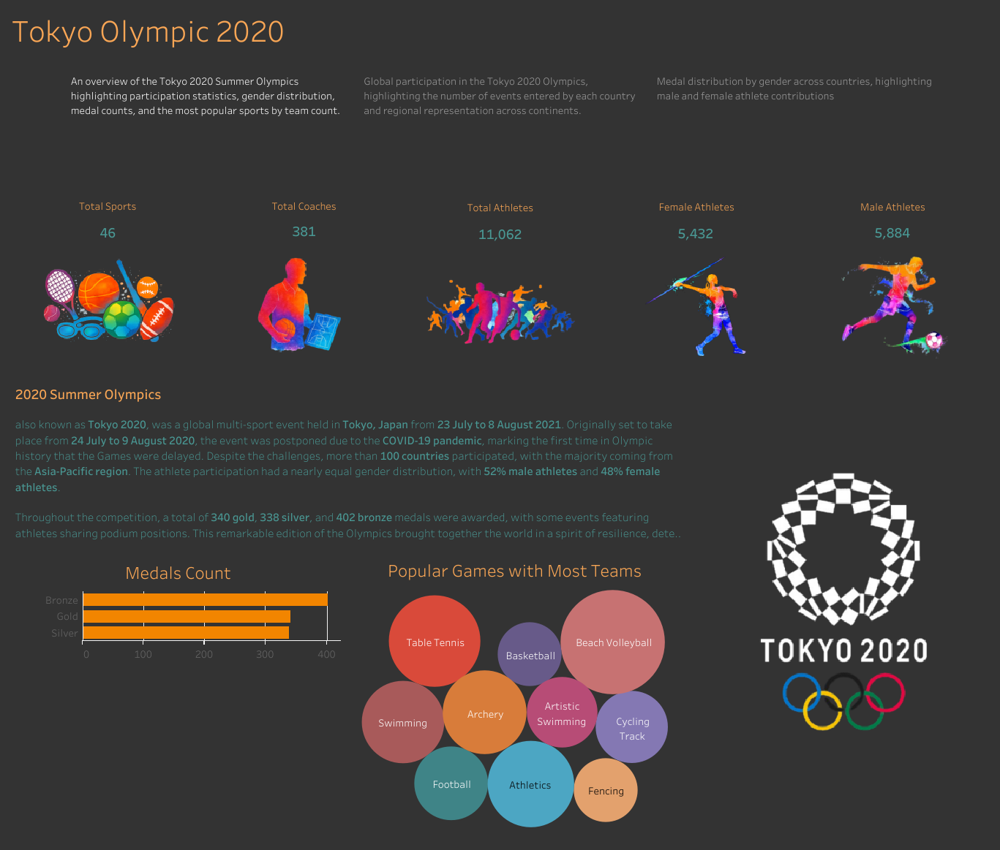

# Azure Data Engineering Project: Olympic Data Pipeline

## Project Overview
This project demonstrates an end-to-end data engineering pipeline on Azure Cloud, extracting Olympic data from a Kaggle dataset, transforming it, and analyzing it to gain insights. The solution uses various Azure services to build a complete data workflow.

## Business Requirements
- Extract Olympic athlete, coach, and medal data from multiple sources
- Store raw data in a data lake for historical preservation
- Clean and transform the data for analysis
- Generate insights about medal distribution, athlete participation, and country performance
- Create visualizations to understand Olympic trends

## Technology Stack
- **Azure Data Factory**: Data ingestion and pipeline orchestration
- **Azure Data Lake Storage Gen2**: Raw and transformed data storage
- **Azure Databricks**: Data transformation using Apache Spark
- **Azure Synapse Analytics**: Data analysis and SQL queries
- **Power BI**: Data visualization and reporting

## Dataset
The project uses Tokyo 2021 Olympic data containing:
- **Athletes.csv**: 11,000 athletes with 47 disciplines
- **Coaches.csv**: Coach information
- **EntriesGender.csv**: Gender distribution by sport
- **Medals.csv**: Medal counts by country
- **Teams.csv**: Team participation data

## Implementation Steps

### 1. Azure Environment Setup
- Create Azure Storage Account with hierarchical namespace enabled
- Set up containers for raw and transformed data
- Create Azure Data Factory workspace
- Provision Azure Databricks workspace

### 2. Data Ingestion with Azure Data Factory
- Create linked service to GitHub raw data URLs
- Build copy pipelines for each dataset
- Load data into raw data lake container
- Validate successful data transfer

### 3. Data Transformation with Azure Databricks
- Mount Data Lake storage to Databricks
- Read raw data files into Spark DataFrames
- Perform transformations:
  - Correct data types (string to integer)
  - Calculate averages and percentages
  - Filter and aggregate data
- Write transformed data back to data lake

### 4. Data Analysis with Synapse Analytics
- Connect to transformed data in data lake
- Run SQL queries for insights:
  - Top countries by gold medals
  - Gender distribution by sport
  - Athlete-to-coach ratios
- Prepare data for visualization

### 5. Visualization with Tableau

The Olympic data insights are presented through an interactive Tableau dashboard:  
[View Dashboard](https://public.tableau.com/app/profile/syed.jafri2681/viz/Book1_17458050470850/Summary?publish=yes)
The dashboard is structured into three main tabs, with snapshots provided for each:

#### ➔ Summary Tab
- Overview of the Tokyo 2020 Olympics.
- Key statistics including:
  - 207 disciplines
  - 11,062 athletes
  - 381 coaches
- Medal totals: 340 gold, 338 silver, and 402 bronze medals awarded.

**Snapshot:**  

#### ➔ Participating Countries Tab
- **World Map**: Displays country-wise event participation, sized by event volume and color-coded by region.
- **Top 10 Participants Treemap**: Highlights countries with the highest number of events (e.g., Japan, United States, Italy).

**Snapshot:**  

#### ➔ Medal Efficiency Tab
- **Medals Achieved by USA**: Breakdown of gold (39), silver (41), and bronze (33) medals.
- **Medal Count Bar Chart**: Total medal counts by country.
- **Popular Sports Bubble Chart**: Highlights popular disciplines such as Athletics, Football, and Judo.
- **Gender vs Discipline Chart**: Analysis of male and female participation across sports.

**Snapshot:**  

Each tab allows users to drill down into detailed insights, filter by country or sport, and dynamically interact with the data for deeper analysis.

